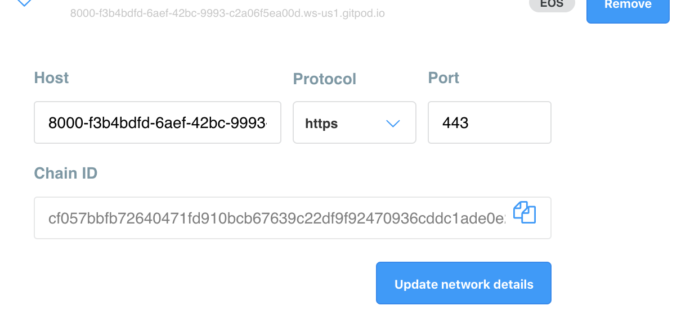
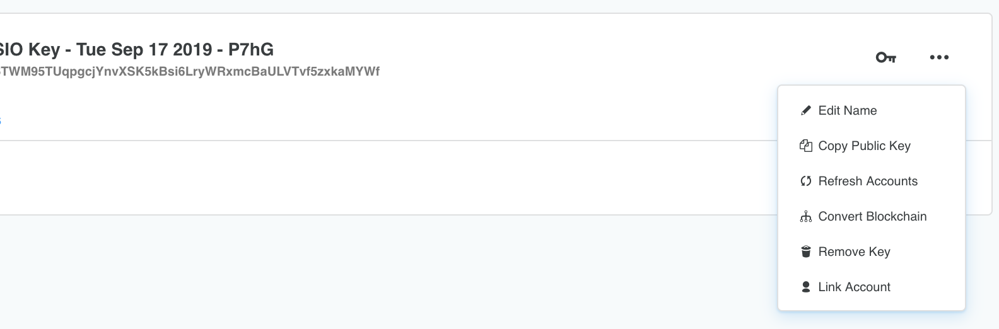
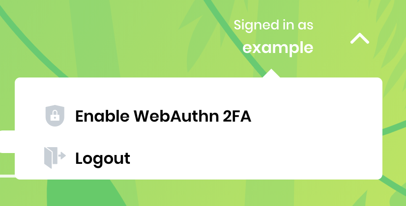
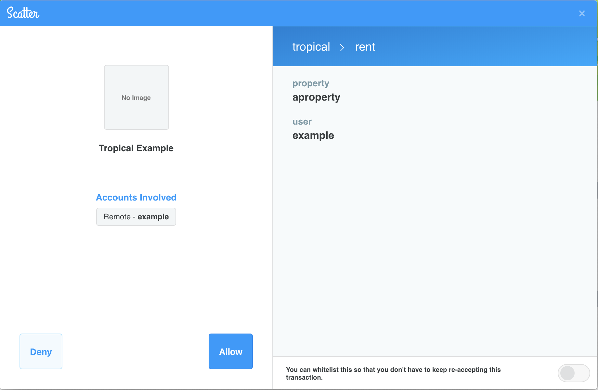
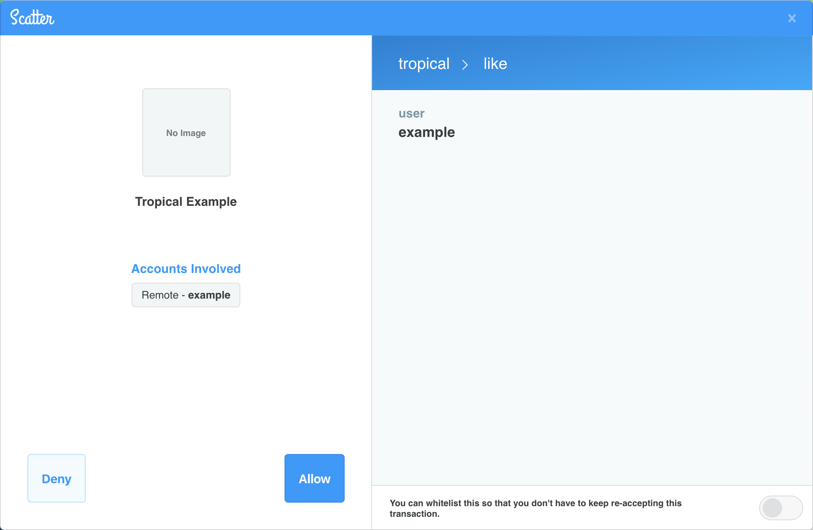

# 🌴 Tropical Example <!-- omit in toc -->
Tropical Example is a mock application for renting properties. It will be referenced throughout this guide as an example for application developers to start building secure applications with a good user experience on the EOSIO blockchain.


## About EOSIO Labs <!-- omit in toc -->

EOSIO Labs repositories are experimental. Developers in the community are encouraged to use EOSIO Labs repositories as the basis for code and concepts to incorporate into their applications. Community members are also welcome to contribute and further develop these repositories. Since these repositories are not supported by Block.one, we may not provide responses to issue reports, pull requests, updates to functionality, or other requests from the community, and we encourage the community to take responsibility for these.

## Overview <!-- omit in toc -->

### Try it out in Gitpod ###

Gitpod [launches the app](https://gitpod.io/#https://github.com/EOSIO/tropical-example-web-app) for you. It starts the required blockchain in the background, launches the web server, and opens a preview window.
NOTES:
 1) There are several times during startup it might look like startup hangs, namely... near the end of the docker build, once the IDE comes up, and then once the preview shows.
 2) Sometimes when Gitpod launches the webapp preview, it does so prematurely.  Just click the small refresh circular arrow icon in the top left of the preview window.
 3) Gitpod generates a dynamic URL for the browser to access the app from. This URL is needed in numerous parts of the app, so note that there is code in this repo specifically meant for Gitpod compatibility. A comment has been added in those locations to point it out.
 4) To use Scatter in Gitpod, launch the demo in Gitpod, then go into Scatter's Networks section and add a custom network with the following settings as well as adding the account name. Note that these settings will need to be updated each time you launch the demo in Gitpod (because the URL will be different each time).
    * Network Settings
      * **Host**: <the hostname Gitpod generated to view the web page; it's what's in the address bar of the browser it opened for you, except *without* the "https://" or a final "/">
      * **Protocol**: https
      * **Port**: 443
      * **Chain ID**: cf057bbfb72640471fd910bcb67639c22df9f92470936cddc1ade0e2f2e7dc4f (This is the test chainId used in the example)
      
    * Adding account name
      * After you've imported the private key from this example (see other parts of the README for those instructions), Scatter might not pull the "example" account from the network. If that's the case, in the Wallet section, if "example" doesn't show up under your imported key with a balance to the right, on a Mac, you'll hold Ctrl when you click the three horizontal dot button to the right of your imported key. Ctrl will enable a normally-hidden item called "Link Account". Click that and in the first box, type "example" and in the drop-down, select the custom network you created above.  See screenshot below for what this looks like.
      
Read more about [Gitpod workspaces here](https://gitpod.io)

The following open source repositories are utilized in Tropical Example:

* Using the [Universal Authenticator Library (UAL)](https://github.com/EOSIO/universal-authenticator-library/) for quick and easy integration with multiple authentication providers (wallets).
* Increasing the security and transparency of your application by following the [Manifest Specification](https://github.com/EOSIO/manifest-spec).
* Displaying human readable Ricardian Contracts of your proposed EOSIO actions by following the [Ricardian Specification](https://github.com/EOSIO/ricardian-spec).

## Table of Contents <!-- omit in toc -->
- [Universal Authenticator Library (UAL)](#universal-authenticator-library-ual)
  - [Installation](#installation)
  - [Setup](#setup)
  - [UAL Context](#ual-context)
  - [Login](#login)
    - [Modal](#modal)
    - [Account Name](#account-name)
  - [Transactions](#transactions)
  - [Logout](#logout)
  - [Errors](#errors)
    - [Login Errors](#login-errors)
    - [Transactions Errors](#transactions-errors)
- [Manifest Specification](#manifest-specification)
- [Ricardian Specification](#ricardian-specification)
- [WebAuthn](#web-authn)
- [Running Tropical Example](#running-tropical-example)
  - [Required Tools](#required-tools)
  - [Setup](#setup-1)
    - [.env file defaults](#env-file-defaults)
  - [Installation](#installation-1)
  - [Running Nodeos](#running-nodeos)
  - [Running Frontend](#running-frontend)
  - [Login](#login-1)
  - [Using WebAuthn](#using-webauthn)
    - [Other Available Actions](#other-available-actions)
  - [Docker Compose Command Reference](#docker-compose-command-reference)
- [Links](#links)
- [Contributing](#contributing)
- [License](#license)
- [Important](#important)

## Universal Authenticator Library (UAL)

An Authenticator provides the ability to communicate with an authentication provider. Authentication providers generally allow users to add, modify, and delete private / public key pairs and use these key pairs to sign proposed transactions.

UAL allows developers to support multiple Authenticators with only a few lines of code. This significantly reduces the start up time of creating applications by removing the need to detect and create an interface for interacting with the Authenticators.

UAL provides users with a common login interface in which they can select the Authenticator of their choice to interact with the EOSIO protocol. Once a user selects the Authenticator of their choice and logs in, the application developer will have access to an `activeUser` object which contains all necessary fields and functions to sign transactions and customize their user experience.

### Installation

First install your [UAL Renderer](https://github.com/EOSIO/universal-authenticator-library#usage-dapp-developer) of choice. Tropical Example uses the [UAL Renderer for ReactJS](https://github.com/EOSIO/ual-reactjs-renderer) and the rest of the examples will be demonstrating usage with the React Renderer. Please view the [UAL documentation](https://github.com/EOSIO/universal-authenticator-library#usage-dapp-developer) for links to all available renderers with documentation and examples of their usage.

```bash
yarn add ual-reactjs-renderer
```

Then install the Authenticators you want to allow users to interact with. Tropical Example uses the following Authenticators:
- [UAL for EOSIO Reference Authenticator](https://github.com/EOSIO/ual-eosio-reference-authenticator)
- [UAL for Scatter](https://github.com/EOSIO/ual-scatter)
- [UAL for Lynx](https://github.com/EOSIO/ual-lynx)
- [UAL for Token Pocket](https://github.com/EOSIO/ual-token-pocket)

```bash
yarn add ual-eosio-reference-authenticator
yarn add ual-scatter
yarn add ual-lynx
yarn add ual-token-pocket
```

### Setup

In your root React component (for most projects this will be index.js) wrap your App component with `UALProvider`.

The `UALProvider` requires an array of Chains you wish your app to transact on, an array of Authenticators you want to allow users to interact with, and an application name. Each Authenticator requires at least an array of Chains that you want to allow the Authenticator to interact with and a second options parameter that may be required. Please see the documentation of the Authenticator if this options argument is required and what fields are necessary.

```javascript
// UAL Required Imports
import { UALProvider } from 'ual-reactjs-renderer'
// Authenticator Imports
import { EOSIOAuth } from 'ual-eosio-reference-authenticator'
import { Scatter } from 'ual-scatter'
import { Lynx } from 'ual-lynx'
import { TokenPocket } from 'ual-token-pocket'
...
const appName = 'Tropical Example'

// Chains
const chain = {
  chainId: process.env.REACT_APP_CHAIN_ID,
  rpcEndpoints: [
    {
      protocol: process.env.REACT_APP_RPC_PROTOCOL,
      host: process.env.REACT_APP_RPC_HOST,
      port: process.env.REACT_APP_RPC_PORT,
    },
  ],
}

// Authenticators
const eosioAuth = new EOSIOAuth([chain], { appName, protocol: 'eosio' })
const scatter = new Scatter([chain], { appName })
const lynx = new Lynx([chain])
const tokenPocket = new TokenPocket([chain])

const supportedChains = [chain]
const supportedAuthenticators = [eosioAuth, scatter, lynx, tokenPocket]

ReactDOM.render(
  <UALProvider chains={supportedChains} authenticators={supportedAuthenticators} appName={appName}>
    <App />
  </UALProvider>,
  document.getElementById('root'),
)
```

### UAL Context

The UAL Renderer for ReactJS uses [Context](https://reactjs.org/docs/context.html) to expose the objects and functions needed to interact with UAL. The context is created by the `UALProvider`. There are two methods to gain access to this context:

1) The `withUAL` [HOC (Higher Order Component)](https://reactjs.org/docs/higher-order-components.html) can be used to pass the `UALProvider` context as props to the wrapped component.

* **When using the `withUAL` HOC all of the `UALProvider` context will be available under the parent prop `ual`**

```javascript
  import { withUAL } from 'ual-reactjs-renderer'
  class Example extends React.Component {
    render() {
      const { ual: { logout } } = this.props
      return <div onClick={logout}>Logout</div>
    }
  }

  export default withUAL(Example)
```

2) The `static contextType` property can be set on a class to the renderer's exported context object, `UALContext`. This allows the context to be referenced using `this.context` within the class.

* **Using the static `contextType` to access the context is currently only supported by React component classes and not supported by functional components. For functional components, `withUAL` must be used if access to the context is required.**

```javascript
  import { UALContext } from 'ual-reactjs-renderer'
  class Example extends React.Component {
    static contextType = UALContext

    render() {
      const { logout } = this.context
      return <div onClick={logout}>Logout</div>
    }
  }
```

### Login

#### Modal

By default, the `UALProvider` provides a modal at the root level of your application. This modal will render the login buttons of all the configured Authenticators that can be detected in the user’s environment. The modal is hidden by default, but can be displayed and dismissed by calling the functions `showModal` and `hideModal`, respectively. Both functions are set in the `UALProvider` context.

```javascript
import { withUAL } from 'ual-reactjs-renderer'
class App extends React.Component {
  ...
  displayLoginModal = (display) => {
    const { ual: { showModal, hideModal } } = this.props
    if (display) {
      showModal()
    } else {
      hideModal()
    }
  }
  ...
}

export default withUAL(App)
```

#### Account Name

After logging in, an `activeUser` object is returned by the Authenticator and set in the `UALProvider` context.

On the `activeUser` object a `getAccountName` method is available. This method returns a promise, which will resolve to a string containing the signed in account name.

```javascript
import { UALContext } from 'ual-reactjs-renderer'
class UserInfo extends React.Component {
  static contextType = UALContext
  ...
  async componentDidMount() {
    const { activeUser } = this.context
    if (activeUser) {
      const accountName = await activeUser.getAccountName()
      this.setState({ accountName })
    }
  }
  ...
}
```

### Transactions

In order to propose transactions, your application needs access to the `activeUser` object returned by the logged in Authenticator.

At the time of signing, call `activeUser.signTransaction` with a valid transaction object and a [configuration object](https://github.com/EOSIO/universal-authenticator-library/blob/master/src/interfaces.ts#L40). This will propose the transaction to the logged in Authenticator.

It is **highly recommended** in the transaction configuration to provide a `expireSeconds` property of a time greater than at least `300` seconds or 5 minutes. This will allow sufficient time for users to review and accept their transactions before expiration.

```javascript
import { UALContext } from 'ual-reactjs-renderer'
import { generateTransaction } from 'utils/transaction'
...
class Property extends React.Component {
  static contextType = UALContext
  ...
  onLike = async () => {
    const { login, displayError } = this.props
    // Via static contextType = UALContext, access to the activeUser object on this.context is now available
    const { activeUser } = this.context
    if (activeUser) {
      try {
        const accountName = await activeUser.getAccountName()
        const transaction = generateTransaction(accountName)
        // The activeUser.signTransaction will propose the passed in transaction to the logged in Authenticator
        await activeUser.signTransaction(transaction, { broadcast: true, expireSeconds: 300 })
        this.setState({ liked: true })
      } catch (err) {
        displayError(err)
      }
    } else {
      login()
    }
  }
  ...
}

export default Property
```

The method `activeUser.signTransaction` returns a promise, which, if signing is successful, will resolve to the [signed transaction response](https://github.com/EOSIO/universal-authenticator-library/blob/master/src/interfaces.ts#L52).

### Logout

If you want to logout, you can use the logout function set in the `UALProvider` context.

```javascript
import { UALContext } from 'ual-reactjs-renderer'
class UserInfo extends React.Component {
  static contextType = UALContext
  ...
  renderDropdown = () => {
    const { logout } = this.context
    return (
      <div className='user-info-dropdown-content'>
        <UserDropdown logout={logout} />
      </div>
    )
  }
  ...
}

export default UserInfo
```

### Errors

Errors thrown by UAL are of type [`UALError`](https://github.com/EOSIO/universal-authenticator-library/blob/master/src/UALError.ts), which extends the generic `Error` class, but has extra information that is useful for debugging purposes.

#### Login Errors

During login, errors are set in the `UALProvider` context.

```javascript
// Using withUAL() HOC
this.props.ual.error
```

```javascript
// Using static contextType
this.context.error
```

#### Transactions Errors

During signing, errors will be thrown by `activeUser.signTransaction`. It is recommended to use the `try...catch` statement to capture these thrown errors.

```javascript
try {
  await activeUser.signTransaction(transaction, transactionConfig)
} catch (error) {
  // Using JSON.parse(JSON.stringify(error)) creates a copy of the error object to ensure
  // that you are printing the value of object at the moment you log it
  console.error('UAL Error', JSON.parse(JSON.stringify(error)))
}
```

_If you need information not covered in this guide, you can reference the full UAL repository [here](https://github.com/EOSIO/universal-authenticator-library)._

## Manifest Specification

Tropical Example follows the Manifest Specification by providing the following:

* A publicly accessible [app-metadata.json](https://github.com/EOSIO/tropical-example-web-app/blob/master/public/app-metadata.json).
* A publicly accessible [chain-manifests.json](https://github.com/EOSIO/tropical-example-web-app/blob/master/public/chain-manifests.json)
* Registering the app's Manifest on the local chain [via cleos](https://github.com/EOSIO/tropical-example-web-app/blob/master/eosio/scripts/deploy_contracts.sh#L114)

_If you need information not covered in this guide, you can reference the Manifest Specification [here](https://github.com/EOSIO/manifest-spec)._

## Ricardian Specification

Tropical Example follows the Ricardian Specification by providing the following:

* A [tropical.contracts.md](https://github.com/EOSIO/tropical-example-web-app/blob/master/eosio/contracts/tropical/tropical.contracts.md), which defines the Ricardian Contract of the `like` action of the `tropical` contract.
* Generating the `tropical` abi file with [eosio-cpp](https://github.com/EOSIO/tropical-example-web-app/blob/master/eosio/scripts/deploy_contracts.sh#L80) by passing the `-abigen` flag, which will auto generate an abi including the `tropical.contracts.md` into the `ricardian_contract` field of the `like` action.

_If you need information not covered in this guide, you can reference the Ricardian Specification [here](https://github.com/EOSIO/ricardian-spec)._

## WebAuthn

Tropical Example implements WebAuthn as a 2nd factor.

After logging in, under the user menu, you'll find an option to "enroll" a 2FA device. Use this option in conjunction with your device's build-in biometric scanner, secure element, or external hardware key to enroll a key with the Tropical Example.

Then, on the Properties Search Results page, you'll see a 'Rent' button. Where liking something is a relatively low-risk activity, the Rent button represents a real-world use case for commiting yourself to rent that property. In this case where money is on the line, the app will request you sign for the Rent action with the enrolled key.

Read more about this example and technology [here -- REQUIRE LINK to blog or Release Notes of some kind](https://www.google.com)

## Running Tropical Example

### Required Tools

* [Yarn](https://yarnpkg.com/lang/en/) with support at `^1.15.2` (latest stable).
* [Docker](https://www.docker.com/) with support at Docker Engine `18.09.2` (latest stable).
* [Docker Compose](https://docs.docker.com/compose/).
  * Mac and Windows environments - By default the Docker Compose tool is installed with Docker.
  * Linux - Follow [these instructions to install Docker Compose](https://docs.docker.com/compose/install/).
* [Node.js](https://nodejs.org/en/) with support at `^10.15.3` LTS. **NOTICE** This project will not build on the current version of Node.js `12.3.1` due to an error in a sub-dependency of `react-scripts`.

This project was bootstrapped with [Create React App](https://github.com/facebook/create-react-app).

### Setup

Create a `.env` file from the `default.env`
```bash
cp default.env .env
```

Tropical Example uses an environment configuration for the Chain and RPC endpoints. By default it will query the local node setup by Docker Compose in this repo. If you want to use another Chain, update the values in the .env file you created in the first step to set the preferred Chain you wish your app to transact on.

#### .env file defaults

```
REACT_APP_CHAIN_ID=cf057bbfb72640471fd910bcb67639c22df9f92470936cddc1ade0e2f2e7dc4f
REACT_APP_RPC_PROTOCOL=http
REACT_APP_RPC_HOST=localhost
REACT_APP_RPC_PORT=8888
```

### Installation

```bash
yarn
```
Run this first to install all the project's dependencies.

### Running Nodeos

Before the app can be run, the Tropical Example contract must be deployed on the chain configured in the `.env` to the account `tropical`.

This repo provides a `docker-compose.yml` that will setup and deploy the `tropical` contract using Docker Compose.

Then run the following to start up a local node:
```bash
yarn up
```

You can view the contract in the [eosio/contracts directory](https://github.com/EOSIO/tropical-example-web-app/tree/master/eosio/contracts/tropical).

### Running Frontend

```yarn startSecure
```
This command runs the app in development mode over SSL. You can also run `yarn start` to run the app without SSL. You will need to install a self-signed SSL certificate or enable [allow-insecure-localhost](chrome://flags/#allow-insecure-localhost) if running over SSL in chrome.
Open [https://localhost:3000](https://localhost:3000) to view it in the browser.

The page will reload if you make edits.

### Login

The Docker Compose setup scripts provide an, `example` account, that can be imported into your Authenticator of choice to login and sign transactions:

⚠️ ***Never use this development key for a production account! Doing so will most certainly result in the loss of access to your account, this private key is publicly known.*** ⚠️
```bash
# Example Account Public Key
EOS6TWM95TUqpgcjYnvXSK5kBsi6LryWRxmcBaULVTvf5zxkaMYWf
# Example Account Private Key
5KkXYBUb7oXrq9cvEYT3HXsoHvaC2957VKVftVRuCy7Z7LyUcQB
```

### Using WebAuthn

After setting up the application and logging in, you can enable WebAuthn if you want to be able to `rent` a property.


Once you enable WebAuthn with your choice of hardware, you can browse to the list of properties and select `rent`. Scatter will prompt you to allow this action by authenticating with your hardware.


After confirming the transaction, you should now see an indicator that your property has been rented successfully.


#### Other Available Actions

You can like a property (WebAuthn not required). After browsing to the list of properties and selecting `like`, scatter will prompty you to allow this action.


After confirming the transaction, you should now see an indicator that your property has been liked successfully.


### Docker Compose Command Reference

```bash
# Create and start the docker container
docker-compose up eosio
# Stop the docker container
docker-compose down eosio
# Open a bash terminal into the docker container
docker-compose exec eosio /bin/bash
```

## Links
- [Universal Authenticator Library (UAL)](https://github.com/EOSIO/universal-authenticator-library)
- [Manifest Specification](https://github.com/EOSIO/manifest-spec)
- [Ricardian Specification](https://github.com/EOSIO/ricardian-spec)
- [Docker Compose CLI Reference](https://docs.docker.com/compose/reference/)

## Contributing
Check out the [Contributing](./CONTRIBUTING.md) guide and please adhere to the [Code of Conduct](./CONTRIBUTING.md#conduct)

## License
[MIT licensed](./LICENSE)

## Important

See LICENSE for copyright and license terms. Block.one makes its contribution on a voluntary basis as a member of the EOSIO community and is not responsible for ensuring the overall performance of the software or any related applications. We make no representation, warranty, guarantee or undertaking in respect of the software or any related documentation, whether expressed or implied, including but not limited to the warranties of merchantability, fitness for a particular purpose and noninfringement. In no event shall we be liable for any claim, damages or other liability, whether in an action of contract, tort or otherwise, arising from, out of or in connection with the software or documentation or the use or other dealings in the software or documentation. Any test results or performance figures are indicative and will not reflect performance under all conditions. Any reference to any third party or third-party product, service or other resource is not an endorsement or recommendation by Block.one. We are not responsible, and disclaim any and all responsibility and liability, for your use of or reliance on any of these resources. Third-party resources may be updated, changed or terminated at any time, so the information here may be out of date or inaccurate. Any person using or offering this software in connection with providing software, goods or services to third parties shall advise such third parties of these license terms, disclaimers and exclusions of liability. Block.one, EOSIO, EOSIO Labs, EOS, the heptahedron and associated logos are trademarks of Block.one.

Wallets and related components are complex software that require the highest levels of security. If incorrectly built or used, they may compromise users’ private keys and digital assets. Wallet applications and related components should undergo thorough security evaluations before being used. Only experienced developers should work with this software.
